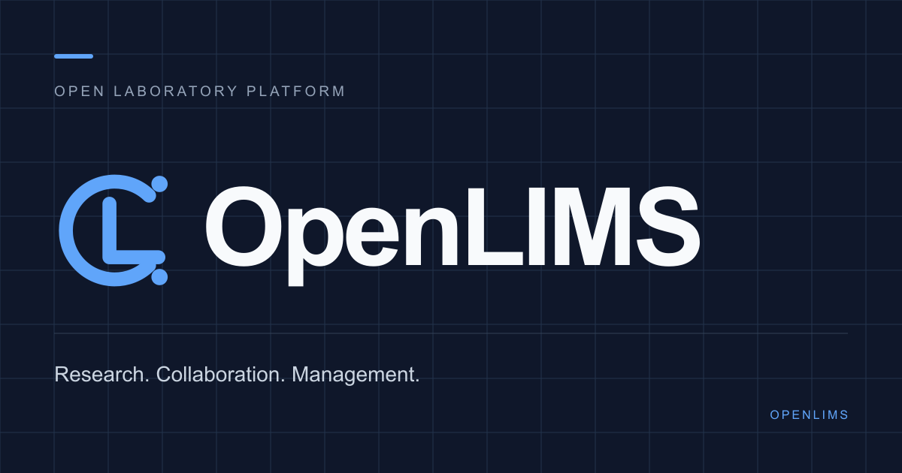

# YES Lab

YES Lab（Yichun Embodied Science）是一个面向高校实验室的开源准备中平台，覆盖公开官网、成员主页、招新流程、项目协作、竞赛成果、讨论板和站内通知。项目采用前后端分离架构，本地可以使用 H2 零配置启动，生产环境提供 MySQL、Docker Compose、Caddy HTTPS 和 GitHub Actions 镜像发布方案。



> 当前项目仍在整理开源发布条件。业务代码可以运行，但仓库尚未选择开源许可证；公开发布前请先阅读[许可证说明](#许可证)。

## 功能概览

- **公开展示**：实验室介绍、研究方向、成员、项目、竞赛成果、新闻、赞助伙伴与内容管理。
- **账号与权限**：教师、核心学生、普通成员、游客四类角色；JWT 访问令牌与可轮换刷新令牌。
- **招新管理**：报名、初筛、面试预约与叫号、技能测试占位、试用期和正式成员转换。
- **成员主页**：公开资料、富文本介绍、头像、项目和获奖成果展示顺序。
- **项目团队**：负责人、指导老师、成员与项目管理员，支持项目资料、主图和公开展示。
- **竞赛成果**：队长提交、证书和图集上传、管理员审核、首页排序与比赛倒计时。
- **讨论与通知**：公开浏览讨论，成员发帖、回复和点赞；机器人“梅琳娜”推送业务通知。
- **生产运维**：MySQL + Flyway、Docker Compose、Caddy 自动 HTTPS、备份和 Ubuntu 24.04 引导脚本。

测验、写题、积分计算、竞赛批量导入和项目即时聊天尚未实现。相关权限或字段仅用于保留模块边界，请勿将其视为可用功能。

## 技术栈

| 层级     | 技术                                                                        |
| -------- | --------------------------------------------------------------------------- |
| 前端     | Vue 3、Vue Router、Vite、Tiptap、Three.js、Lucide Icons                     |
| 后端     | Java 21、Spring Boot 4.1、Spring Security、Spring Data JPA、Bean Validation |
| 身份认证 | HS256 JWT、BCrypt、HttpOnly 刷新 Cookie、服务端令牌摘要与轮换               |
| 数据库   | 本地 H2 文件数据库；生产 MySQL 8.4 + Flyway                                 |
| 内容安全 | OWASP Java HTML Sanitizer、上传文件签名和大小校验                           |
| 部署     | Docker、Docker Compose、Caddy、GHCR、GitHub Actions                         |
| 工程质量 | ESLint、Prettier、Maven Wrapper、JUnit / Spring Boot Test                   |

## 架构与目录

```text
YES Lab/
├── src/                         # Vue 页面、组件、路由和 API 客户端
├── public/                      # 静态图片、Logo 与 3D 模型
├── backend/
│   ├── src/main/java/           # Spring Boot 业务代码
│   ├── src/main/resources/      # 本地/生产配置与 Flyway 迁移
│   ├── src/test/                # 后端自动化测试
│   └── docs/                    # API 模块边界与权限说明
├── deploy/                      # Caddy、生产环境示例和运维脚本
├── docs/                        # 生产部署手册
├── .github/workflows/           # CI 与容器镜像发布
├── compose.yaml                 # MySQL、API、Web 生产编排
└── DEVLOG.md                    # 关键决策、验证记录和待办
```

浏览器默认请求同源 `/api`。本地由 Vite 将 `/api` 和 `/actuator` 代理到 Spring Boot；生产由 Caddy 提供静态站点、HTTPS 和反向代理。API 在本地使用 H2，在 `prod` profile 下由 Flyway 管理 MySQL 结构。

更细的后端边界见[模块说明](backend/docs/module-boundaries.md)，角色规则见[访问控制设计](backend/docs/access-control.md)。

## 快速开始

### 1. 准备环境

- Node.js `>= 22.13.0`
- npm `>= 10`
- Java 21（JDK，而不是仅 JRE）
- Git

Maven 无需全局安装，仓库已经包含 Maven Wrapper。MySQL 也不是本地开发的必需项。

确认版本：

```bash
node --version
npm --version
java -version
```

如果 macOS 同时安装了多个 JDK，可以用下面的命令选择 Java 21：

```bash
export JAVA_HOME=$(/usr/libexec/java_home -v 21)
```

### 2. 获取代码并安装前端依赖

```bash
git clone https://github.com/KaoXiaoYu/YES-Lab.git
cd YES-Lab
npm ci
```

项目统一使用 npm，依赖以 `package-lock.json` 为准。修改依赖时使用 `npm install`，普通拉取和 CI 使用 `npm ci`。

### 3. 启动后端

新开一个终端：

```bash
cd backend
./mvnw spring-boot:run
```

Windows PowerShell 使用：

```powershell
cd backend
.\mvnw.cmd spring-boot:run
```

后端默认地址为 <http://127.0.0.1:8080>，健康检查为 <http://127.0.0.1:8080/actuator/health>。首次启动会创建 `backend/data/` 下的 H2 数据库和上传目录，并写入本地演示数据。

### 4. 启动前端

再开一个终端，在仓库根目录运行：

```bash
npm run dev
```

访问终端显示的地址，通常是 <http://127.0.0.1:5173>。如果 5173 已被占用，Vite 会选择其他端口，以终端输出为准。

### 5. 使用演示账号

以下账号只会在本地默认配置中初始化：

| 账号      | 密码                   | 角色                  | 可体验内容                 |
| --------- | ---------------------- | --------------------- | -------------------------- |
| `teacher` | `YesLab-Teacher-2026!` | 教师 / 系统管理员     | 全部管理功能               |
| `core`    | `YesLab-Core-2026!`    | 核心学生 / 系统管理员 | 与教师相同的管理权限       |
| `member`  | `YesLab-Member-2026!`  | 普通成员              | 个人主页、项目、成果、讨论 |

游客流程：打开 `/register` 使用邮箱注册，然后进入 `/application` 填写报名表。

生产 profile 强制关闭这些演示账号。请勿把本地默认密码用于公开环境。

## 使用教程

### 公开官网与主页内容

1. 未登录访问首页即可查看实验室简介、成员、项目、成果和新闻。
2. 使用教师或核心学生账号登录。
3. 打开“主页编辑”，维护品牌文案、研究方向、栏目标题、赞助伙伴和展示顺序。
4. 成员、项目、比赛和新闻的详细数据仍在各自管理模块维护；主页编辑只控制聚合展示。

### 招新流程

1. 游客注册后填写自己的报名表。
2. 管理员在“招新管理”推进 `报名 → 初筛 → 面试 → 技能测试 → 试用期`。
3. 管理员发布面试场次并配置面试官，进入面试阶段的游客可以预约或取消。
4. 面试官在场次中叫号、记录结论或将未到场者移至队尾。
5. 进入试用期后，管理员可转换为正式成员；原报名和面试历史会保留。

### 成员与个人主页

1. 管理员在“成员管理”维护姓名、内部编号、角色、学籍信息、状态和能力标签。
2. 成员在“编辑个人主页”维护头像、标语、联系方式和富文本介绍。
3. 成员可以选择公开展示的项目与已认证成果，并调整顺序。
4. 公开接口不会返回内部编号和内部联系方式。

### 项目团队

1. 管理员创建项目并指定负责人，可选指导老师、成员和项目管理员。
2. 负责人管理团队结构；负责人、项目管理员和系统管理员维护项目资料及主图。
3. 开启“允许公开展示”后，项目会进入公开数据范围。
4. 当前团队空间用于资料和成员协作，不包含即时消息或群文件。

### 竞赛成果、讨论与通知

- 实验室成员可作为队长提交比赛记录；已结束比赛必须上传证书并等待管理员审核。
- 审核通过后，比赛详情、图集和关联成员成果可以公开展示。
- 讨论板允许匿名浏览；正式成员可发帖、回复和点赞，管理员可置顶和处理内容。
- “梅琳娜”只发送系统业务通知，不提供成员之间的私信接口。

## 常用命令

| 命令                                   | 说明                                   |
| -------------------------------------- | -------------------------------------- |
| `npm run dev`                          | 启动 Vite 开发服务器                   |
| `npm run build`                        | 构建生产前端                           |
| `npm run preview`                      | 本地预览生产构建                       |
| `npm run lint`                         | 检查前端 JavaScript / Vue 代码         |
| `npm run lint:fix`                     | 自动修复可安全处理的 lint 问题         |
| `npm run format`                       | 使用 Prettier 统一前端、配置和文档格式 |
| `npm run format:check`                 | 检查格式但不修改文件                   |
| `npm run check`                        | 依次执行 lint、格式检查和生产构建      |
| `cd backend && ./mvnw test`            | 运行后端测试                           |
| `cd backend && ./mvnw spring-boot:run` | 启动本地 API                           |

提交前至少运行：

```bash
npm run check
cd backend && ./mvnw test
```

## 配置说明

### 前端

默认不需要环境文件。只有前后端确实部署在不同源时，才复制 `.env.example` 为 `.env.local`：

```bash
cp .env.example .env.local
```

```dotenv
VITE_API_BASE_URL=https://api.example.com
```

### 本地后端

常用可选变量：

| 变量                          | 默认值                                        | 用途                       |
| ----------------------------- | --------------------------------------------- | -------------------------- |
| `SERVER_PORT`                 | `8080`                                        | API 端口                   |
| `YESLAB_DATABASE_URL`         | `jdbc:h2:file:./data/yeslab;AUTO_SERVER=TRUE` | 数据库连接                 |
| `YESLAB_BOOTSTRAP_ENABLED`    | `true`                                        | 是否初始化本地演示数据     |
| `YESLAB_JWT_SECRET`           | 本地开发值                                    | JWT 签名密钥；生产必须替换 |
| `YESLAB_CORS_ALLOWED_ORIGINS` | 本地地址与已配置站点                          | 跨域来源白名单             |
| `YESLAB_*_DIRECTORY`          | `./data/...`                                  | 各类上传文件目录           |

完整配置以 [`application.yml`](backend/src/main/resources/application.yml) 和 [`application-prod.yml`](backend/src/main/resources/application-prod.yml) 为准。生产环境变量示例位于 [`deploy/.env.production.example`](deploy/.env.production.example)。

不要提交 `.env.local`、`deploy/.env.production`、数据库、上传文件、令牌或真实账号信息；这些路径已由 `.gitignore` 排除。

## 数据与迁移

- 本地业务数据和上传文件默认位于 `backend/data/`，不进入 Git。
- 生产数据位于 MySQL 和仓库外上传目录，代码更新不会携带业务数据。
- 生产数据库结构由 `backend/src/main/resources/db/migration/` 中的 Flyway 脚本管理。
- 已发布的 Flyway 迁移不可修改或重排；结构变更必须新增更高版本迁移。
- 正式升级前先备份数据库和上传目录，并完成过至少一次恢复演练。

## 生产部署

仓库提供面向 Ubuntu 24.04 的完整部署基线：GitHub Actions 在 `main` 分支通过检查后构建 Web/API 镜像并发布到 GHCR，服务器通过 Docker Compose 运行 MySQL、Spring Boot 和 Caddy。

生产部署涉及域名、HTTPS、镜像权限、数据库密钥、首次管理员、备份和回滚。请不要只复制 README 中的本地命令上线，按[正式部署手册](docs/production-deployment.md)逐项执行。

## 文档索引

- [后端快速说明](backend/README.md)
- [API 模块边界](backend/docs/module-boundaries.md)
- [角色与访问控制](backend/docs/access-control.md)
- [正式部署、备份与迁移](docs/production-deployment.md)
- [贡献指南](CONTRIBUTING.md)
- [安全策略](SECURITY.md)
- [开发日志](DEVLOG.md)

## 参与贡献

欢迎通过 Issue 和 Pull Request 参与。提交前请先阅读[贡献指南](CONTRIBUTING.md)，保持变更聚焦、补充必要测试，并同步更新相关文档和 `DEVLOG.md`。安全漏洞不要提交公开 Issue，请按[安全策略](SECURITY.md)私下报告。

## 许可证

当前仓库尚未包含 `LICENSE`，因此即使仓库可公开访问，也不代表代码已经获得复制、修改或再分发授权。仓库所有者应在正式开源前根据预期用途选择许可证（例如 MIT、Apache-2.0 或 GPL-3.0），加入对应 `LICENSE` 后再更新本节。

`public/models/` 中的第三方 3D 模型不随项目未来许可证重新授权。其来源、修改说明和各自的 Apache-2.0 / BSD-3-Clause 文本已保留在该目录，分发时必须继续保留这些文件。
